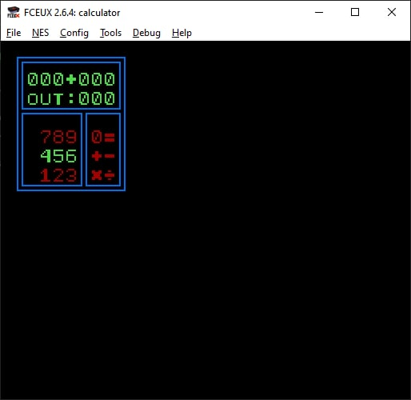
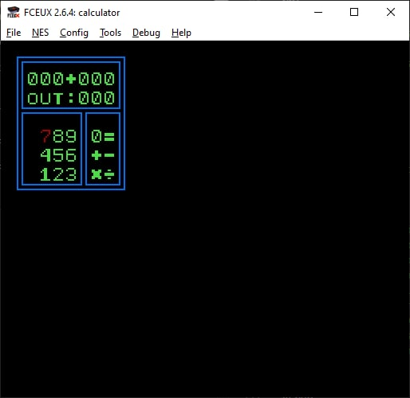
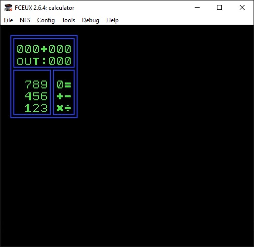
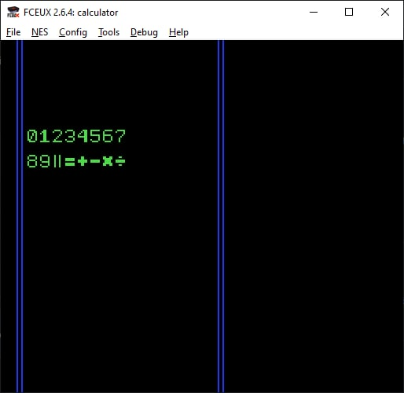
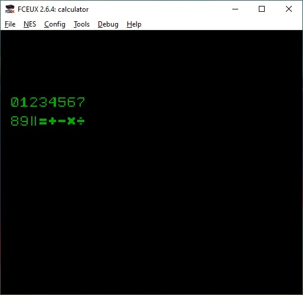

# NES Devblog (test)

# 2022.07.24

Proper holden/pressed/released button handling. Palette resetting after cursor moved to another key.

# 2022.07.22

Now buttons can be chosen by UP, DOWN, LEFT and RIGHT buttons. Chosen button will be recolored to palette number 2.

**TODO**: change selected button only when button released or do not read new inputs until button released so you can only move cursor by one sprite at once.

**TODO**: change unselected button palette to default. 

# 2022.07.19

Joypad input readings and sprite color change when RIGHT button pressed.

# 2022.07.11

Basic calculator layout.

## 2022.07.10

Understand (almost) background drawing.

## 2022.07.07

Testing sprites for calculator app.

## 2022.07.04

New NES project: [https://github.com/SomgBird/nes-calculator](https://github.com/SomgBird/nes-calculator).

## 2022.06.30

Sprite loading and drawing.

## 2022.06.22

Default program initialization. Palette setup. Background color change.

