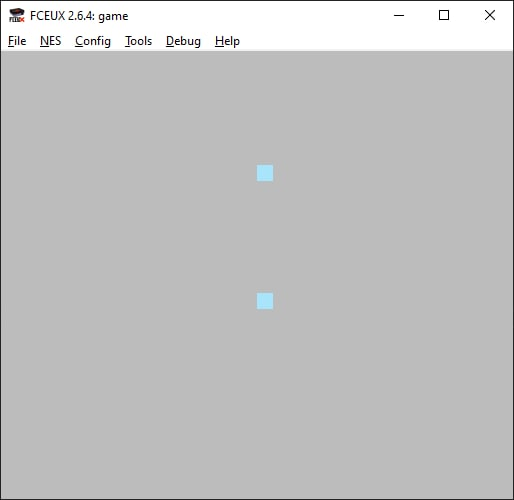

# NES Devblog (test)

# 2022.07.11

Joypad input readings and sprite color change when right button pressed.

# 2022.07.11

Basic calculator layout.

## 2022.07.10

Understand (almost) background drawing.

## 2022.07.07

Testing sprites for calculator app.

## 2022.07.04

New NES project: [https://github.com/SomgBird/nes-calculator](https://github.com/SomgBird/nes-calculator).

## 2022.06.30

Sprite loading and drawing.

## 2022.06.22

Default program initialization. Palette setup. Background color change.

